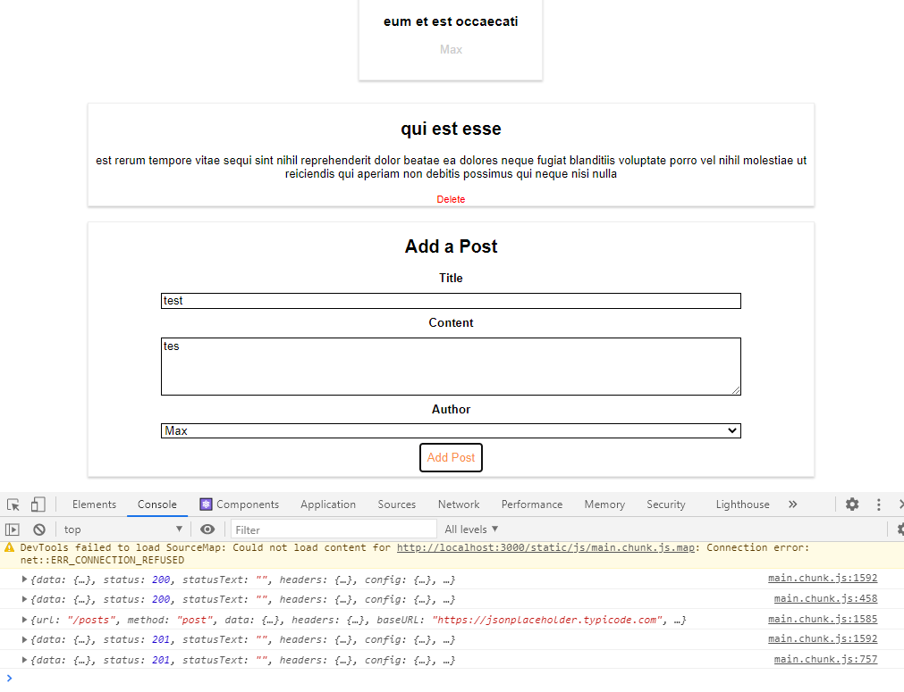

# 🏆 Posts-App---React-HTTP-Requests 🏆

##### **Badge:**

## **Link:** 
* https://williamsffc.github.io/Posts-App---React-HTTP-Requests/

## **Description:**
* The Posts App will generate HTTP requests to a server to pull Posts, create Posts or delete Posts.

## **Table of Contents:**
1. [Installation](#installation)
2. [Usage](#usage)
3. [Questions](#questions)
4. [Link](#link)
5. [Screenshots](#screenshots) 

## **Installation:**
* From terminal: `node index.js`

## **Usage:**
* To have a better understanding of HTTP requests using React.js

## **Questions:**
* wlliamsffc@gmail.com

## **Link:**
* [GitHub] - https://github.com/williamsffc

## **Screenshots:**

-------------
© Copyright - 2020

